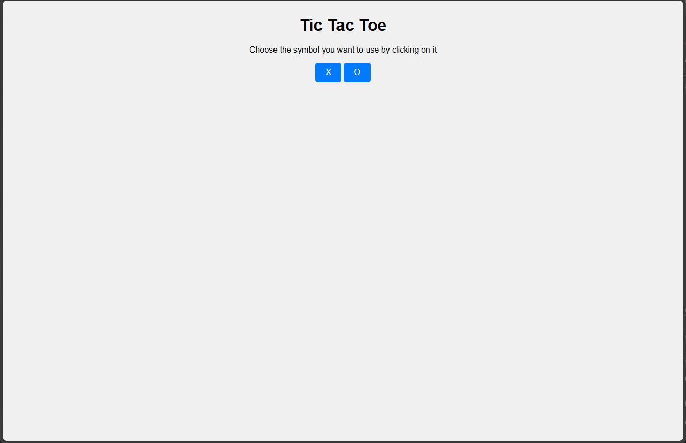
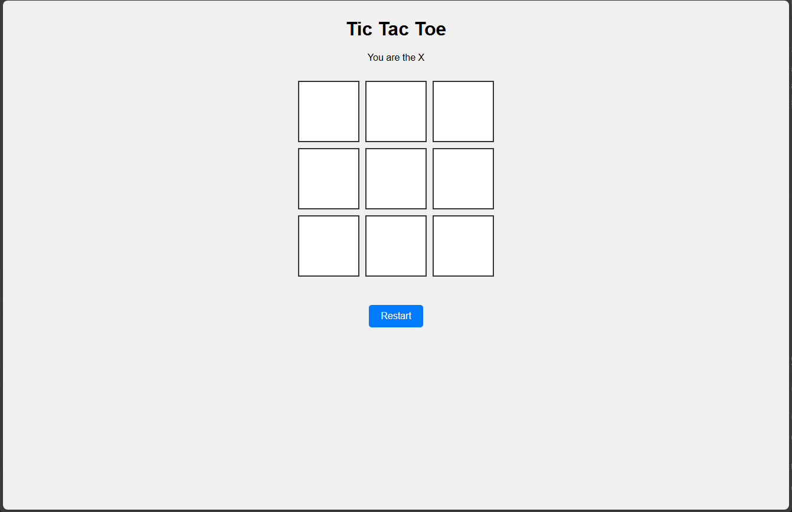

# tictactoe
microservice-based project aiming to build a flexible and extensible Tic Tac Toe game, with potential to evolve into a multi-game platform.

## 📖 Table of Contents
- [Tic Tac Toe rules](#-tic-tac-toe-rules)
- [Architecture overview](#-services)
    - [API](#-api)
    - [Interface](#️-interface)
- [Getting Started](#-getting-started)

## 🎮 Tic Tac Toe Rules

Two players compete on a 3x3 grid with the goal of being the first to align three of their pawns horizontally, vertically, or diagonally.

### 🧩 Pawn Types

- One player uses the `X` pawn  
- The other player uses the `O` pawn

### 🔄 Turn-Based Gameplay

- Players take turns alternately  
- On each turn, a player places their symbol in an empty cell

### 🏁 End of the Game

- If a player aligns three of their pawns, they win  
- If all cells are filled and no player has aligned three pawns, the game ends in a draw

📚 *Source:* [Official Game Rules – Tic Tac Toe](https://officialgamerules.org/game-rules/tic-tac-toe/)

## 🧱 Services

This app uses a **microservices architecture**, allowing:
- Reusability of the API across different interfaces
- Easy integration of future mini-games

### 📡 API
Here you will find all the detailled information on the API service.

#### 🔗 Endpoints
The API allows you to :
- Create a new Tic Tac Toe game
- Play a turn in a current Tic Tac Toe game and inform you on the game status
- Get settings of a Tic Tac Toe game

For detailed information on each endpoint, including request/response formats refer to the `routes` and `models` folders.

#### ⚙️ Configuration
You can customize the Tic Tac Toe game by adjusting parameters in the `config.py` file.

- `GRID_LENGTH`  
  Determines the size of the game board.  
  - Example: `3` creates a 3x3 grid (classic Tic Tac Toe).  
  - Larger values like `5` create a 5x5 grid for extended gameplay.

- `PAWNS_TO_ALIGN`  
  Sets how many identical symbols must be aligned to win.  
  - Example: `3` means a player needs 3 in a row to win.  
  - You can increase this value for more challenging matches (e.g., `4` or `5`).
  - Always needs to be <= GRID_LENGTH

#### 🧪 Test
To test the service, navigate to the `API/tests` directory and run the following command:  

*▶ PowerShell (Windows)*
```powershell
$env:PYTHONPATH = ".."
pytest -vv
```
*▶ Bash (Linux/macOS)*
```sh
PYTHONPATH=.. pytest -vv
```

### 🖥️ Interface
The provided interface is simple and easy to use. Feel free to customize it or create a new one that better suits your needs.

To access the interface, open the file named `index.html`. Make sure the API is running beforehand—otherwise, you'll need to refresh the page after starting the API, as explained in the **Getting Started** section.

Interaction is entirely mouse-based, so no keyboard input is required.

#### 🖼️ Previews
Here are some previews of the interface:





## 🚀 Getting Started
In this section, you will find all you need to run the API smoothly and start playing with ease.

### ✅ Prerequisites

- Python **3.10** or higher

### 📦 Installation

Navigate to the `API` directory of the project and install dependencies:

```bash
pip install -r requirements.txt
```

### ▶️ Launch the API

Start the server using **Uvicorn**:
```sh
uvicorn main.py
```
The API will be accessible locally at `http://127.0.0.1:8000` by default.

### 🕹️ Play the game

Use the provided interface or connect your own frontend to interact with the API.

Enjoy ! 😉

## Contributors
<a href="https://github.com/GitBoy497"></a>
